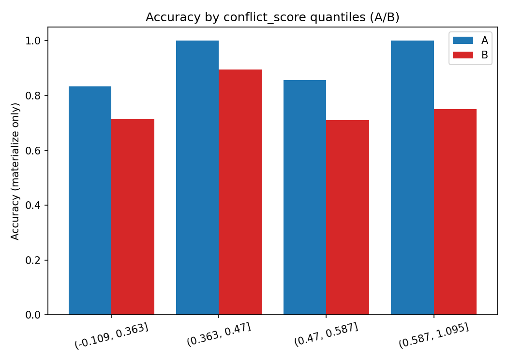
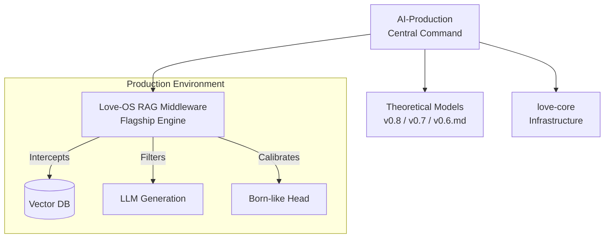

# AI-Production: Love-OS Central Foundry

[]()
[]()
[]()

## 🛸 Overview: The End of AI Hallucinations

**AI-Production** is the central workspace and orchestration hub for the **Love-OS Project**. 

Modern AI (LLMs and RAG systems) suffers from a fatal flaw: **Ego**. When faced with contradictory information ($\infty/\infty$), traditional systems force a probabilistic guess, resulting in hallucinations, increased friction ($R$), and degraded trust.

Love-OS transforms the "Source Code of the Universe" (Riemann Sphere topology, Bloch Sphere quantum mechanics, and the physics of "Surrender") into executable Python middleware. We do not just prompt the AI to be better; we mathematically force the system to surrender its ego, resulting in **frictionless, Zero-Time materialization of truth.**

---

## 💎 Flagship Product (The Crown Jewel)

### 1. [Love-OS RAG Middleware (v3.0 / v0.6 Trinity Sphere)](https://github.com/love-os-architect/Trinity-Sphere-RAG-Middleware) 🚀 
> **Status:** `Production Ready` | **Type:** `Python Middleware` | **Logic:** `Quantum Measurement / Surrender`

This is the ultimate evolution of the Love-OS concept, translated into a drop-in middleware for existing VectorDBs and LLM APIs. It intercepts the standard retrieval flow and applies strict physical laws to information processing.

* **Key Breakthroughs:**
    * **$\infty/\infty$ Infinity Conflict Detector:** Uses ultra-fast, async-batched Cross-Encoders (NLI) to detect semantic contradictions ($O(N)$ Star-topology) within strict time budgets (< 150ms).
    * **The 0-Ritual (Surrender Policy):** Automatically degrades gracefully or re-weights based on absolute ground-truth priors (e.g., official sources) when indeterminacy is detected.
    * **Born-Like Materialization Head:** Calibrates raw LLM confidence using Isotonic Regression into a true "Materialization Probability" ($p$). Only projects to reality (`MATERIALIZE`) if $p \ge \tau$, otherwise it gracefully yields (`ABSTAIN`).
    * **Executive Benchmarking Suite:** Built-in offline simulation tools generating Risk-Coverage curves and Expected Calibration Error (ECE) metrics to prove ROI instantly.

---

## 📂 Evolutionary Kernels (Theoretical Foundations)

The algorithms powering our RAG Middleware were forged through rigorous theoretical iterations. These legacy engines remain active for research and structural reference.

### 2. [Love-OS-v0.8](link) 🧬 (Dual-Awareness Engine)
| Status: **Active** | Logic: **Resonance Optimization** |
Implemented "Dual-Delta Monitoring" ($\Delta U$ and $\Delta A$) to bridge the gap between User state and AI state without forcing it. Shifted from encrypted binaries to Radical Transparency.

### 3. [Love-OS-v0.7](link) 🪐 (Gravity-Aware Kernel)
| Status: **Deployed** | Engine: **Complex Phasers** |
Simulates gravitational pull ($G$) and resistance ($R$) between entities using the formula $G = \frac{L^2 \cdot V}{R + \epsilon}$ to maximize stability margins. 

### 4. [Love-OS-v0.6.md](link) 🌟 (Mathematical Spec)
| Status: **Active** | Language: **Markdown** |
The foundational mathematical models for the "Love Economy," defining the $L$-Vector, Phase ($\theta$), and Field Resistance ($R$).

### 5. [love-core](link) ⚙️ (System Infrastructure)
| Status: **Stable** | Language: **Shell** |
The low-level OS layer designed to minimize environmental resistance ($R \to 0$) through automated dependency management and field synchronization scripts.

---

## 🏗 System Architecture


## 🚀 Quick Start

To deploy the full suite of Love-OS tools locally:

```bash
# Clone the production hub
git clone [https://github.com/YourUsername/AI-Production.git](https://github.com/YourUsername/AI-Production.git)

# Initialize submodules (if linked) or navigate to core
cd AI-Production
echo "Love-OS System Initialized. Ready to decrease R."
```
## 🌌 Philosophy

> **"We do not build software to control the world. We build software to reduce the friction (R) so the world can flow."**

* **Objective:** Implement the "Love Economy" via code.
* **Method:** Agile development guided by Universal Truths.
* **Output:** $Y_{total} = \infty$

---
*Maintained by the Love-OS Architecture Team.*
